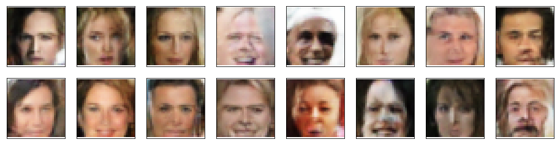
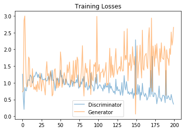

## Project Overview

This project is done as a part of the Udacity's [Deep Learning Nanodegree](https://eu.udacity.com/course/deep-learning-nanodegree--nd101). The Generative Adversarial Network is trained over a preprocessed subset of [celeba dataset](https://drive.google.com/file/d/1PWYIxXk_yrGTozEpq7EOGkhzGl-T2bpT/view?usp=sharing). The trained model is then able to generate new faces.

GANs are implemented using PyTorch framework.

Fake generated faces by the project can be found in [train_samples.pkl](train_samples.pkl)

<div align="center"></div>

Training Losses:
<div align="center"></div>

## Instructions

1. Clone the repository and navigate to the downloaded folder.
	
	```	
		git clone https://github.com/anubhavshrimal/GANs-Generate-Faces.git
		cd GANs-Generate-Faces/
	```
2. Install required dependencies using:
	
	```
		pip install -r requirements.txt
	```
3. Download the dataset zip file from [here](https://drive.google.com/file/d/1PWYIxXk_yrGTozEpq7EOGkhzGl-T2bpT/view?usp=sharing).
4. Open a terminal window and navigate to the project folder. Open the notebook using the bellow command and follow the instructions given in the notebook.
	
	```
		jupyter notebook dlnd_face_generation.ipynb
	```


## Accelerating the Training Process 

If your code is taking too long to run, you will need to switch to running your code on a GPU.  If you'd like to use a GPU, you can use [Google Colab](https://colab.research.google.com/). 

**Note:** Colab is a free service and the data is not persistent. It is suggested to download whatever data you need once your session is idle otherwise you may lose the progress.

You can use Amazon Web Services to launch an EC2 GPU instance which will be persistent. (This costs money)
